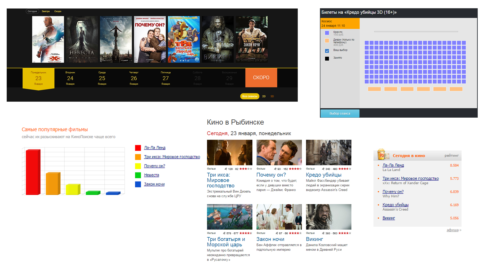

# Лабораторная №2  
_Михайлов М. Д._ 
_Яковлев И. О._ 
_Ляпушкин Н. А._
## __“Результаты МозгоШтурма”__ 

## __“Доска вдохновений”__ 

## __“Поиск потребностей”__ 
#### __Область автоматизации - кино-афиша.__
&nbsp;&nbsp;&nbsp;&nbsp;&nbsp;&nbsp;&nbsp;&nbsp; Проектом будет являться создание небольшого мобильного приложения с виджетами для рабочего стола и уведомлениями для просмотра текущего репертуара в кинотеатрах города. В качестве концепции взята концепция “Взгляд”. Проектирование дашборда с афишей и расписанием сеансов кинотеатров.   

####  __Опрос пользователей и результаты опроса__
&nbsp;&nbsp;&nbsp;&nbsp;&nbsp;&nbsp;&nbsp;&nbsp; Для выяснения пользовательских потребностей был проведен небольшой опрос среди потенциальных пользователей будущего приложения:   
1.  _Сколько раз вы посещали афишу кинотеатров за последний месяц?_ 
2.  _Выбираете ли вы из списка кинотеатров или ходите всегда в один?_ 
3.  _Каким образом вы узнаете расписание сеансов фильма?_ 

&nbsp;&nbsp;&nbsp;&nbsp;&nbsp;&nbsp;&nbsp;&nbsp; В результате было выявлено, что пользователям чаще всего приходится заходить на сайты кинотеатров и узнавать там текущую афишу, расписание и цену билетов, что занимает у них много времени. Поэтому им было бы удобнее делать все это в одном месте. Важным пунктом является минимализм, то есть никакой лишней информации. Если это афиша, то должно быть изображение постера, название фильма, его жанр и год выхода в прокат. Если это расписание, то должно быть название фильма и время проведения сеансов с дополнительной информацией о типе сеанса (3d или 2d) и цена билета.  
#### __Описание приложения__
&nbsp;&nbsp;&nbsp;&nbsp;&nbsp;&nbsp;&nbsp;&nbsp; Проект представляет из себя систему для автоматизации просмотра текущей афиши кинотеатров выбранного города, для просмотра расписания фильмов в кинотеатрах и цен на билеты на выбранные фильмы. Причиной создания проекта стала трата большого количества времени на просмотр всего этого на сайтах самих кинотеатров, что не совсем удобно в городах, где порядка десяти кинотеатров и учитывая, что текущие афиши представляют порядка десятка фильмов.  
#### __Наблюдение и результаты__
&nbsp;&nbsp;&nbsp;&nbsp;&nbsp;&nbsp;&nbsp;&nbsp; Так как у большинства людей имеется смартфон, было принято решение помочь пользователям в их нелегкой жизни и разработать мобильное приложение, с помощью которого можно было бы получать актуальную информацию обо всей кино-афише. В ходе наблюдения за людьми, а так же анализа их деятельности был выявлен ряд неудач: Подобные системы реализованы в видел веб-страниц, что тоже в какой-то мере усложняет доступ к ним с мобильных устройств, было бы легче открыть приложение и сразу узнать текущую афишу кинотеатров. Так же было выявлено неудобство использования современных решений, которые были привязаны только к одной платформе, было принято решение о разработке кроссплатформенного приложения.  
&nbsp;&nbsp;&nbsp;&nbsp;&nbsp;&nbsp;&nbsp;&nbsp; В результате наблюдений и интервьюирования были выявлены следующие пользовательские _потребности_:
* Простое и выгодное решение для выяснения текущей афиши.
* Система должна быть безопасна и позволять человеку тратить минимум времени на ее поддержание. 
* Простое и интуитивное управление, разработанной системы.
* Система должна быть эргономична и удобна в использовании. 
* При длительном отсутствии пользователей, система должна максимально эффективно себя реализовать, с минимумом затрат и максимумом эффективности для владельцев.
